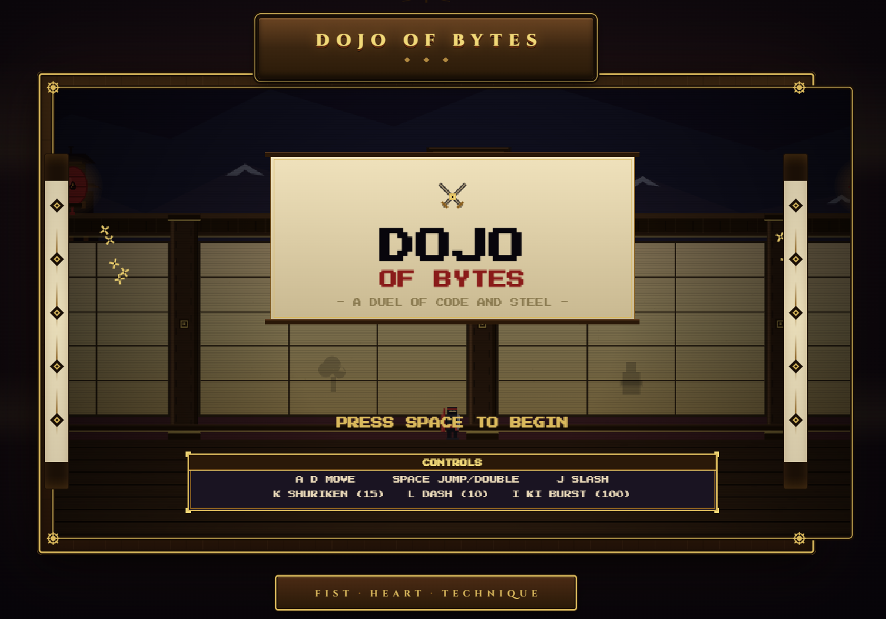

**▶ Open `index.html` in your browser to play. No install required.**

## ⚔️ code-dojo

A dojo-themed browser arcade. My journey from 4th grade HTML, CSS, and JavaScript to writing real game logic and structure.

It started as *Making Your First Dojo Club with Code*, a tiny project I built as a kid: pixel-art recreations of Snake, Pac-Man, and other classics. Years later, I came back to it with everything I'd learned in between.

## 🥷 Dojo of Bytes

*The version I always wished I could build back then.*

**Dojo of Bytes** is a wave-based arena combat game. You play a ninja defending the dojo through five increasingly difficult stages, ending in a duel against **Yama, the Fallen Master**, a two-phase boss with five different attack patterns. Survive with five hearts of health, manage your spirit meter to fuel special moves, and chain attacks together for combo multipliers that boost your score.

The whole thing runs in your browser. No installers, no plugins, no servers. Just open the page and play.

### 🎴 The Story

Long ago, the dojo stood as a place of learning, where masters of the blade trained alongside masters of code. But the Fallen Master, consumed by shadow, has returned to claim it. Five waves of his disciples stand between you and the duel that will decide the dojo's fate.

### 🌸 Game Features

<table>
<tr>
<td width="50%" valign="top">

**⚔️ Combat System**
- Three-button melee, ranged, and dash
- Double-jump and i-frame dashes
- Screen-clearing ki burst ultimate
- Combo multiplier with score bonuses
- Frame-perfect cancels and screen freeze on impact

</td>
<td width="50%" valign="top">

**👹 The Boss Fight**
- Yama, the Fallen Master, with 40 HP
- Five distinct attack patterns
- Two phases. The second is faster and more aggressive
- Charges, ground slams, ki waves, and sweeping slashes
- A dedicated HP bar and dramatic entry

</td>
</tr>
<tr>
<td valign="top">

**🎨 Pixel Art Scene**
- Hand-drawn dojo back wall with shoji panels
- Cherry trees with falling petals
- Hanging paper lanterns that sway
- Distant mountains, pagoda, and moon
- Wooden floor with parallax depth
- Decorative scroll banners and crests

</td>
<td valign="top">

**🔊 Procedural Audio**
- All sound effects synthesized in real time
- No audio files. Just Web Audio oscillators and noise
- Distinct sounds for slashes, jumps, hits, pickups
- Boss roars, ki bursts, and victory fanfares
- Mute toggle (`M`) at any time

</td>
</tr>
</table>

### 🎮 Controls

| Key | Action | Spirit Cost |
|:---:|:---|:---:|
| <kbd>A</kbd> <kbd>D</kbd> | Move left or right | Free |
| <kbd>Space</kbd> | Jump (press again in air to double-jump) | Free |
| <kbd>J</kbd> | Slash with katana | Free |
| <kbd>K</kbd> | Throw shuriken | 15 |
| <kbd>L</kbd> | Dash forward with invincibility | 10 |
| <kbd>I</kbd> | Ki burst, clears the entire screen | 100 |
| <kbd>M</kbd> | Mute or unmute audio | Free |
| <kbd>R</kbd> | Restart after victory or defeat | Free |

### 🏯 The Five Stages

1. **Opening Form**. Two patrol enemies. A warm-up.
2. **Rising Tide**. Three patrols. They move faster.
3. **Crossed Blades**. Two patrols and an archer on the wall.
4. **Storm of Steel**. Three patrols and two archers raining arrows.
5. **The Master Awakens**. Yama descends. Survive him and the dojo is yours.

Each cleared stage restores one heart of health and grants a brief moment to breathe before the next.

## 🚀 How to Play

Open `index.html` in any modern browser. The game runs entirely on your machine, no installation, no plugins, no internet connection required. Use the keyboard controls listed above to move, attack, and survive.

## 🛠️ How It's Built

Vanilla **HTML, CSS, and JavaScript**. No frameworks. No libraries. No build tools. Just the browser doing what browsers do best.

The code is organized as fourteen separate modules under `src/`, each handling one concern:

<table>
<tr>
<th align="left">Module</th>
<th align="left">Responsibility</th>
</tr>
<tr><td><code>config.js</code></td><td>Canvas setup, world dimensions, color palette</td></tr>
<tr><td><code>utils.js</code></td><td>Drawing primitives and math helpers</td></tr>
<tr><td><code>audio.js</code></td><td>Web Audio synthesis and the full sound effect bank</td></tr>
<tr><td><code>input.js</code></td><td>Keyboard state tracking</td></tr>
<tr><td><code>fx.js</code></td><td>Particles, camera, screen shake, hit-stop frames</td></tr>
<tr><td><code>background.js</code></td><td>Sky, mountains, pagoda, cherry trees, dojo wall, floor</td></tr>
<tr><td><code>sprites.js</code></td><td>Character sprite rendering for ninja, enemies, and boss</td></tr>
<tr><td><code>entities.js</code></td><td>Player, enemies, boss state and update logic</td></tr>
<tr><td><code>projectiles.js</code></td><td>Shuriken, arrows, shockwaves, ki waves</td></tr>
<tr><td><code>pickups.js</code></td><td>Health, spirit, and fragment drops</td></tr>
<tr><td><code>waves.js</code></td><td>Wave progression and transition banners</td></tr>
<tr><td><code>hud.js</code></td><td>In-game UI (hearts, spirit bar, score, cooldowns, boss bar)</td></tr>
<tr><td><code>screens.js</code></td><td>Title, victory, and defeat overlay screens</td></tr>
<tr><td><code>main.js</code></td><td>Game state, the update and draw cycle, and the main loop</td></tr>
</table>

### 🧠 Technical Highlights

- **Pixel-perfect rendering** with `imageSmoothingEnabled = false` and integer-only coordinates
- **Camera system** with smooth lerp following and 1.5× zoom for clearer action
- **Hit-stop frames**: the game freezes for 2 frames on every hit landed, making strikes feel weighty
- **Combo system** that tracks consecutive hits, drains over time, and multiplies score
- **State machines** for the boss's five attack patterns and the wave progression
- **Procedural sound**: every effect is built from scratch using oscillators, filtered noise, and ADSR envelopes

## 📖 What I Learned

Coming back to this project years later, I rewrote everything from the ground up. The original was one giant HTML file with everything jammed together. This version is split into focused modules that each do one thing well. I learned how to think about **separation of concerns**, **game loops** that decouple update from render, and how to make a single canvas feel alive with particles, screen shake, and camera work.

I also learned that the most fun part of game development isn't the code. It's the small details. The way the screen freezes for a tenth of a second when you land a hit. The way petals drift down behind the action. The way the boss's eyes glow brighter in phase two. None of those things are necessary, and all of them matter.

## 📜 License

Released under the **MIT License**. See [LICENSE](LICENSE) for the full text. You're free to use, modify, and share this code for any purpose.

*Built with patience, pixel by pixel.*

**FIST · HEART · TECHNIQUE**

